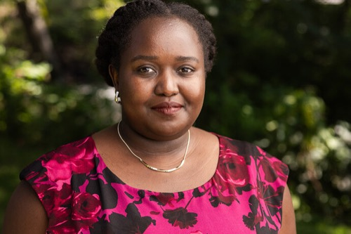
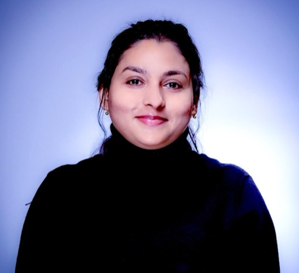

Day 2 · Tuesday, July 28

# HPC Acclimation + Curriculum Map

## Schedule

| Time | Session |
|:---|:---|
| 10:00 – 10:15 AM | Daily agenda review |
| 10:15 – 11:00 AM | Build your curriculum map & schedule |
| 11:00 – 12:00 PM | Faculty Fellows Panel I: Designing AI Learning Experiences Across Disciplines; panelists: [Dr. Feseha Abebe-Akele](#feseha-abebe-akele), [Dr. Edgar J. Lobaton](#edgar-lobaton), [Dr. Oyebade Kunle Oyerinde](#oyebade-oyerinde), [Dr. Diane Uwacu](#diane-uwacu) |
| 12:00 – 12:30 PM | Draft your syllabus |
| 12:30 – 1:30 PM | Lunch |
| 1:30 – 2:00 PM | HPC with VISTA (Architecture, Filesystem, and SSH) |
| 2:00 – 2:30 PM | Module 1: Getting acclimated via Tapis |
| 2:30 – 3:00 PM | Module Builder, Part 1: lecture outline + slide deck |
| 3:00 – 4:00 PM | Faculty Fellows Panel II: Implementing, Evaluating, and Scaling AI Education; panelists: [Dr. Debanjali Banerjee](#debanjali-banerjee), [Dr. Mia Champion](#mia-champion), [Dr. Vanessa D'Amario](#vanessa-damario), [Dr. Ananya Jana](#ananya-jana) |
| Evening | [Cielo Beach Club](#evening) |

## What you'll build today

### Curriculum map

Working from yesterday's learning outcomes, sequence your course week by week (or module by module), noting where the HPC-based assignment should land. Then build the public-facing version; topic and assignment due dates only, no grading detail; into your course site's schedule.

### Syllabus draft

A 30-minute session; this produces a *draft skeleton*, not a finished syllabus. Start from your existing syllabus (if you have one) or the model syllabus provided; either way, upload or paste it and your AI-powered coding assistant will work from what you already have. Pull in your outcomes summary and a link to your schedule. Leave clear placeholders for anything not ready yet (Morehouse Supercomputing Facility access language, grading policy); those get filled in later in the week.

### HPC with VISTA: architecture, filesystem, and SSH

An orientation to the Morehouse Supercomputing Facility's Vista system before you start running anything on it: how the system is organized (login nodes vs. compute nodes), how the filesystem is laid out (home, scratch, and work directories, and what belongs where), and how to connect over SSH. This is the foundation the Tapis session right after builds on.

### Module 1: Getting acclimated via Tapis

Hands-on introduction to accessing HPC resources on the Morehouse Supercomputing Facility via Tapis. Tapis is the layer that lets you (and your students) run jobs on the supercomputer without managing the underlying infrastructure directly; it's the interface between "I want to run this script" and the actual hardware. See [Accessing the Morehouse Supercomputing Facility via TAPIS](resources/accessing-tapis.html) for the full request-to-walkthrough path.

### Module Builder, Part 1: lecture outline + slide deck

Pick **one module** from your curriculum map to build fully, end to end; this becomes the repeatable pattern you copy for every other module later.

1. Draft a lecture outline from your learning outcome for this module. Already have lecture notes or slides for this module? Bring them, and ask your AI-powered coding assistant to restructure them into this format rather than starting over.
2. Build the slide deck; source lives in Canva/Slides (export a PDF once done), or ask your AI-powered coding assistant to generate one directly if you'd rather work from a script.
3. Split public vs. private: the student-facing outline and links go in your public course site; your full prep notes (talking points, timing) stay in your private toolkit.

## Full module instructions

- [Module 02: Learning Outcomes → Curriculum Map](modules/module-02.html); curriculum map portion
- [Module 03: Draft Your Syllabus](modules/module-03.html)
- [Module 04: Module Builder](modules/module-04.html); Part 1 today

## Reference material

- [Accessing the Morehouse Supercomputing Facility via TAPIS](resources/accessing-tapis.html)
- [TAPIS workflows reference](https://ashleyscruse.github.io/nairr-research/03-Compute/05-tapis-workflows/)

## This evening {#evening}

**Cielo Beach Club** · C. Chicago, Punta Cana 23001, Dominican Republic

If you'd like transportation with the group, meet in the lobby of the Royalton Punta Cana Resort & Casino at 5:30 PM.

## Faculty panelists

Headshots and names below link to each panelist's full biography.

### Panel I: Designing AI Learning Experiences Across Disciplines · 11:00 AM – 12:00 PM

<a href="#feseha-abebe-akele">Dr. Feseha Abebe-Akele</a>

<a href="#edgar-lobaton">Dr. Edgar J. Lobaton</a>

<a href="#oyebade-oyerinde">Dr. Oyebade Kunle Oyerinde</a>

<a href="#diane-uwacu">Dr. Diane Uwacu</a>

#### Dr. Feseha Abebe-Akele
Assistant Professor of Genetics, Elizabeth City State University

Dr. Feseha Abebe-Akele is an Assistant Professor of genetics at Elizabeth City State University (ECSU). A seasoned researcher and educator, he previously served as Lead Bioinformatician at the University of New Hampshire's Hubbard Center for Genome Studies and held a faculty position at Texas A&M International University. At ECSU, Dr. Abebe-Akele directs a research lab focusing on soil metagenomics, probiotic yeast synthetic biology, and marine microbiome gene discovery. He also heads a National Artificial Intelligence Research Resource (NAIRR) initiative to establish a biotechnology self-learning hub for high school and university students. He holds a PhD in Genetics from the University of New Hampshire, alongside advanced degrees in Bioinformatics Programming and Molecular Biology.

#### Dr. Edgar J. Lobaton
Director, Applied AI Initiative in Engineering and Computer Science; Professor, Electrical and Computer Engineering, NC State University

Dr. Edgar J. Lobaton is the Director of the Applied AI Initiative in Engineering and Computer Science and a professor in the department of Electrical and Computer Engineering (ECE) at North Carolina State University (NC State). Lobaton earned his B.S. in Mathematics and Electrical Engineering from Seattle University in 2004, and completed his Ph.D. in Electrical Engineering and Computer Sciences from the University of California, Berkeley in 2009. In 2023, he received the William F. Lane Outstanding Teaching Award from the ECE Department; in 2024, the University Faculty Scholars and Outstanding Teacher Awards from NC State. Lobaton was awarded a NAIRR Pilot Classroom award in 2024 to provide GPU resources for several hundred students as part of his undergraduate and graduate course on deep learning for the broader engineering community.

#### Dr. Oyebade Kunle Oyerinde
Full Professor of Public Administration; Special Assistant to the Provost for AI, Data, and Analytics, Clark Atlanta University

Dr. Oyebade Kunle Oyerinde is a Full Professor of Public Administration and Special Assistant to the Provost for AI, Data, and Analytics at Clark Atlanta University. He is a 2026-2027 National Science Foundation NAIRR AI Education Fellow and the 2025 winner of the Outstanding Educator Award, whose work focuses on expanding equitable access to artificial intelligence, data science, and analytics education, particularly within Historically Black Colleges and Universities (HBCUs). Dr. Oyerinde has led innovative curriculum development efforts that integrate AI, machine learning, data science, and computational analytics into graduate and undergraduate education across public administration and interdisciplinary fields. He has mentored students and faculty from disciplines including computer science, engineering, biology, chemistry, business, and social sciences, helping develop data-driven problem-solving skills through research, competitions, and experiential learning. His current work advances the integration of NAIRR resources into teaching, faculty development, workforce preparation, and interdisciplinary AI education to broaden participation in the future AI workforce.

#### Dr. Diane Uwacu
Assistant Professor, Department of Computer Science, Mount Holyoke College

Dr. Uwacu is an assistant professor in the Department of Computer Science at Mount Holyoke College, where she teaches core courses focused on algorithm design and problem-solving. Driven by a commitment to responsible technology, Dr. Uwacu has developed a specialized curriculum exploring AI ethics. As a National Science Foundation National Artificial Intelligence Research Resource (NSF NAIRR) fellow, her current work centers on designing accessible AI literacy curriculum tailored for students across diverse academic disciplines. Through both teaching and research, Dr. Uwacu works to demystify complex computational concepts and empower the next generation of thinkers to navigate the ethical landscape of modern computing.

### Panel II: Implementing, Evaluating, and Scaling AI Education · 3:00 – 4:00 PM

<a href="#debanjali-banerjee">Dr. Debanjali Banerjee</a>

<a href="#mia-champion">Dr. Mia Champion</a>

<a href="#vanessa-damario">Dr. Vanessa D'Amario</a>

<a href="#ananya-jana">Dr. Ananya Jana</a>

#### Dr. Debanjali Banerjee
Assistant Professor of Computer Science, Earlham College

Dr. Debanjali Banerjee is an Assistant Professor of Computer Science at Earlham College. Her teaching and research interests include Artificial Intelligence, Machine Learning, Computer Vision, Medical Image Analysis, Generative Adversarial Networks (GANs), and Explainable AI. She is committed to expanding undergraduate access to AI education through hands-on learning, project-based coursework, and research experiences. As an NSF NAIRR AI Education Fellow, Dr. Banerjee is exploring innovative approaches to integrate AI tools and resources into undergraduate curricula while promoting responsible and ethical use of AI. She has developed and taught AI-focused courses including Image Classification with Deep Learning, and Artificial Intelligence & Machine Learning. She regularly mentors undergraduate students on research projects involving image classification and analysis, including medical imaging, where students learn about different AI model architectures and their application to real-world image-based problems.

#### Dr. Mia Champion
Assistant Teaching Professor, Department of Computing & Software Systems, University of Washington Bothell

Dr. Mia Champion is an Assistant Teaching Professor in the School of STEM's Department of Computing & Software Systems, University of Washington, Bothell, where she teaches software management, machine learning and AI, and cloud computing. With more than 20 years of experience spanning technology, health care, and life sciences, she specializes in genomics research, cloud architectures, and advanced analytics. Dr. Champion holds a PhD in genomics from the University of California-Davis and completed post-doctoral bioinformatics research while working at the Broad Institute of MIT and Harvard in Boston. She was an Assistant Research Professor at the Mayo Clinic before leaving academia to launch a start-up company (CloudOmics). During her recent tenure at Amazon Web Services, she served in a variety of leadership roles dedicated to product and program management and technical business development, as well as serving as a lead data scientist for the AWS Machine Learning Solutions Lab Consultant Team, and as lead product manager overseeing several Amazon Health AI products including Amazon HealthLake, Amazon Genomics CLI, and AWS HealthOmics.

#### Dr. Vanessa D'Amario
Assistant Professor, Nova Southeastern University

Dr. Vanessa D'Amario holds a master's degree in Physics and a PhD in Computer Science from the University of Genova, Italy. Vanessa was a visiting PhD student and subsequently a postdoctoral researcher at MIT, where she engaged in collaborative research with Fujitsu Research of America. Since 2023, she has been an assistant professor at Nova Southeastern University (NSU) in Florida. Her scholarly interests are centered on utilizing technology to enhance health outcomes in low-resource settings and advance social good. As an educator, she is dedicated to preparing learners to responsibly apply artificial intelligence in healthcare, decision-making, data management, and business intelligence. She has developed AI-focused curricula across disciplines, integrating technical skills with a focus on bias, evaluation, and real-world application. She pursued NAIRR-supported initiatives to broaden access to computing resources for education and research, utilized Google Research Credits, and currently serves as an NSF NAIRR AI in Education fellow.

#### Dr. Ananya Jana
Assistant Professor, Department of Computer Science, Marshall University

Dr. Ananya Jana received her M.S. degree from the Indian Institute of Technology Guwahati, India, in 2012 and her Ph.D. in computer science from Rutgers University in 2023. She is currently an Assistant Professor with the Department of Computer Science, Marshall University, where she conducts research in computer vision and artificial intelligence. Prior to joining Marshall University, she was an Assistant Professor at Alvernia University. Before joining academia, she was briefly a postdoctoral fellow at Rutgers University, sponsored by the Colgate-Palmolive Company, and received the Colgate-Palmolive Year-Long Fellowship twice during her Ph.D. studies. She is the recipient of the NSF NAIRR AI Educator Fellowship at CRA for the year 2026-27.

Next up: **Day 3**; dataset discovery, quiz + assignment material, and running your first Jupyter job.
